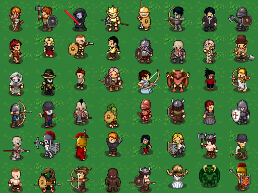
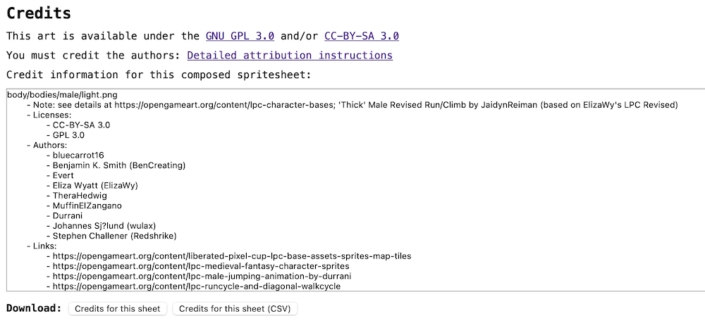

# Alkema

Alkema is an open-source character sprite generator API built on the [Universal LPC Spritesheet Character Generator](Universal-LPC-Spritesheet-Character-Generator/README.md). It provides a RESTful API for generating customizable character sprites using LPC (Liberated Pixel Cup) assets.

## Features

- **PostgreSQL Database:** 667 LPC items with complete metadata, tags, and layer information
- **Dynamic Sprite Generation:** Real-time character sprite composition from individual layers
- **Full Animation Support:** Generates complete spritesheets with all 15 LPC animations
- **Body Type Support:** Male, Female, Teen, and Pregnant body types
- **Smart Item Compatibility:** Tag-based dependency system ensures items work together
- **RESTful API:** FastAPI backend with automatic documentation
- **Docker Deployment:** Complete containerized setup with PostgreSQL and API services

## Technology Stack

- **PostgreSQL** - Database for sprite metadata and relationships
- **FastAPI** - High-performance Python web framework
- **SQLAlchemy** - Database ORM
- **Pillow** - Image processing and sprite composition
- **Docker & Docker Compose** - Containerized deployment

## Installation

### Prerequisites

- [Docker Desktop](https://www.docker.com/products/docker-desktop/) installed and running
- Python 3.8+ (for local testing)
- Git

### Quick Start

1. Clone the repository:
   ```bash
   git clone https://github.com/ColoradoStark/Alkema.git
   cd Alkema
   ```

2. Run the build script:
   ```bash
   BuildScript.bat
   ```

   This will:
   - Create a Python virtual environment
   - Build the Docker containers
   - Start PostgreSQL database
   - Populate the database with LPC item data
   - Start the API server

3. Access the services:
   - **API:** http://localhost:8000
   - **API Documentation:** http://localhost:8000/docs
   - **Legacy Generator:** http://localhost:8080

## API Usage

### Generate Character Sprite

**POST** `/api/generate-sprite`

Generate a complete character spritesheet with all animations.

#### Request Body:
```json
{
  "body_type": "male",
  "items": [
    {"type": "body", "item": "body", "variant": "light"},
    {"type": "eyes", "item": "eyes", "variant": "blue"},
    {"type": "hair", "item": "hair_messy1", "variant": "blonde"},
    {"type": "clothes", "item": "torso_clothes_longsleeve", "variant": "brown"},
    {"type": "legs", "item": "legs_pants", "variant": "teal"}
  ]
}
```

#### Response:
- Returns a PNG image of the complete character spritesheet (832x3392 pixels)
- Contains all 15 animations in the standard LPC format

### Get Available Options

**GET** `/api/available-options/{body_type}`

Get all available items for a specific body type.

#### Parameters:
- `body_type`: One of `male`, `female`, `teen`, `pregnant`

#### Response:
```json
{
  "body": [
    {
      "name": "Human",
      "file_name": "body",
      "variants": ["light", "medium", "dark", "dark2", ...],
      "tags": []
    }
  ],
  "hair": [...],
  "clothes": [...],
  ...
}
```

### Get Compatible Items

**POST** `/api/available-options/{body_type}`

Get items compatible with current selections (respects dependencies).

#### Request Body:
```json
{
  "current_selections": [
    {"type": "body", "item": "body", "variant": "light"},
    {"type": "hat", "item": "hat_hood_chain"}
  ]
}
```

## Example Requests

### Simple Character
```bash
curl -X POST "http://localhost:8000/api/generate-sprite" \
  -H "Content-Type: application/json" \
  -d '{
    "body_type": "male",
    "items": [
      {"type": "body", "item": "body", "variant": "light"},
      {"type": "eyes", "item": "eyes", "variant": "blue"}
    ]
  }' --output character.png
```

### Full Character
```bash
curl -X POST "http://localhost:8000/api/generate-sprite" \
  -H "Content-Type: application/json" \
  -d '{
    "body_type": "female",
    "items": [
      {"type": "body", "item": "body", "variant": "medium"},
      {"type": "eyes", "item": "eyes", "variant": "green"},
      {"type": "hair", "item": "hair_princess", "variant": "red"},
      {"type": "clothes", "item": "dress_slit", "variant": "blue"},
      {"type": "legs", "item": "legs_pants", "variant": "black"},
      {"type": "feet", "item": "feet_shoes_black", "variant": "black"}
    ]
  }' --output princess.png
```

## Development

### Local Testing

After running the build script, you can test the API:

```bash
# Activate the virtual environment
venv\Scripts\activate.bat

# Run test script
python test_api.py
```

### Database Management

The database is automatically populated on first run. To reset:

```bash
docker compose down -v  # Remove volumes
BuildScript.bat         # Rebuild and repopulate
```

### View Logs

```bash
docker compose logs -f api
docker compose logs -f postgres
```

## Project Structure

```
Alkema/
├── API-Character-Sprite-Generator/
│   ├── main_v2.py          # FastAPI application
│   ├── models.py            # SQLAlchemy database models
│   ├── sprite_generator.py  # Sprite composition logic
│   ├── ingest_lpc_data.py  # Database population script
│   └── startup.py           # Container startup script
├── Universal-LPC-Spritesheet-Character-Generator/
│   ├── spritesheets/        # LPC sprite assets
│   └── sheet_definitions/   # JSON metadata (667 items)
├── docker-compose.yml       # Docker services configuration
└── BuildScript.bat          # Windows build/run script
```

## Animations Included

Each generated spritesheet includes:
- Spellcast (4 rows)
- Thrust (4 rows)
- Walk (4 rows)
- Slash (4 rows)
- Shoot (4 rows)
- Hurt (1 row)
- Climb (1 row)
- Idle (4 rows)
- Jump (4 rows)
- Sit (4 rows)
- Emote (4 rows)
- Run (4 rows)
- Combat Idle (4 rows)
- Backslash (4 rows)
- Halfslash (3 rows)

## Screenshots

Example characters generated using the LPC assets:




## Credits

This project uses assets from the [Liberated Pixel Cup](https://lpc.opengameart.org) and the [Universal LPC Spritesheet Character Generator](Universal-LPC-Spritesheet-Character-Generator/README.md). Please see the [CREDITS.csv](Universal-LPC-Spritesheet-Character-Generator/CREDITS.csv) file for detailed attribution.

## License

See [Universal-LPC-Spritesheet-Character-Generator/LICENSE](Universal-LPC-Spritesheet-Character-Generator/LICENSE)

## Contributing

Contributions are welcome! Please feel free to submit issues or pull requests.

## Special Thanks

A big thanks to [OpenGameArt.org](https://opengameart.org/) and the LPC community for making these amazing assets available.