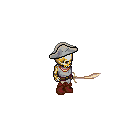
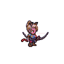
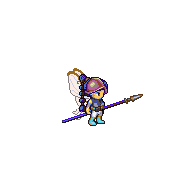
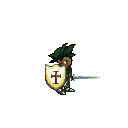

# Alkema

  
  
  
  

<em>Example characters generated by the API — each one unique</em>

A character creator and multiplayer game built on [Liberated Pixel Cup](https://lpc.opengameart.org) sprites. Create characters with deep aesthetic customization, equip weapons and armor, and test them in a live multiplayer environment.

## Character Creator

### Races and Body Types

30 playable races across 8 body types. Each race has its own forced features (elf ears, demon wings, furry tails), skin color palettes, and equipment restrictions.

**Races** — Human, Elf, Grey Elf, Orc, Goblin, Troll, Minotaur, Lizard, Dragonblood, Angel, Demon, Vampire, Skeleton, Zombie, Alien, and more — plus Fey variants (Pixie, Sylph, Dark) and Furry variants (Cat, Fox, Wolf, Bunny).

**Body types** — Male, Female, Muscular, Teen, Child, Pregnant, Skeleton, Zombie.

### Classes and Equipment

13 character classes, each with preferred weapons, armor, and equipment rules.

**Classes** — Warrior, Mage, Ranger, Thief, Pirate, Cleric, Noble, Guard, Merchant, Peasant, and age-based starter classes.

**Armor weights** — Heavy, Normal, Light, Formal, Topless, and Nude — each controlling which clothing and accessories are available.

### Aesthetic Customization

657 items across 104 categories. Mix and match:

- **91 hairstyles** with color variants
- **52 hats** with trims, buckles, and overlays
- **9 shields** with 49 heraldic patterns, paint, and trim layers
- **Cosmetics** — beards, mustaches, earrings, necklaces, hair extensions, scars, wounds
- **Race features** — wings, tails, horns, fins, furry ears
- **10 color palettes** that coordinate fabrics, accents, and metals across all equipped items

### Name Generation

Race-aware fantasy name generator produces unique names based on race and gender — humans get different naming conventions than orcs, fey, demons, or furry races.

## Weapons and Combat

### 36 Weapons

Swords, axes, polearms, daggers, bows, crossbows, slingshots, staves, wands, and more. Each weapon maps to the correct attack animation:

- **Swords and blades** → Slash (with oversized 128px or 192px attack frames)
- **Polearms and spears** → Thrust (oversized)
- **Bows, crossbows, slingshots** → Shoot (with projectile spawning)
- **Staves and wands** → Thrust or Slash depending on weapon

### Hit Detection

Server-side collision using oriented bounding boxes (OBB) computed per-frame from actual weapon sprite alpha data. Melee hits check point-in-OBB, ranged weapons spawn projectiles with their own collision. Hit cooldowns prevent multi-hits per attack swing.

### 15 Animations

Walk, Run, Idle, Combat Idle, Slash, Thrust, Spellcast, Shoot, Backslash, Halfslash, Jump, Sit, Emote, Hurt — all in 4 directions. Weapons with oversized sprites (128px, 192px) get larger attack frames automatically.

## Multiplayer

Real-time multiplayer via Socket.io. Players share a 4096×4096 tile map world with:

- Live character movement and animation sync
- Attack and spellcast broadcasting
- Equipment changes reflected in real time
- Player join/leave events
- Mobile-responsive layout with touch controls

## Art Attribution

Every LPC sprite asset is tracked to its original artist and license. The API generates per-character credit files listing all contributing artists, their licenses (CC-BY-SA, CC-BY, CC0, OGA-BY, GPL), and source URLs — so attribution stays accurate no matter which items a character uses. 71 artists credited across the current asset library.

## API

A REST API powers all character generation. Full interactive docs at `/docs` (Swagger UI).

| Endpoint | Description |
|----------|-------------|
| `POST /generate-sprite` | Generate a character spritesheet PNG from item selections |
| `GET /random-character` | Generate a random character with race/class/armor rules |
| `GET /random-character/sprite` | Random character as a PNG |
| `POST /generate-gif` | Animated GIF promo image from selections |
| `GET /random-character/gif` | Random character as an animated GIF |
| `POST /character-credits` | Per-character artist attribution file |
| `GET /items`, `GET /items/{category}` | Browse the item database |
| `POST /available-options` | Items compatible with current selections |
| `GET /classes`, `GET /rules` | Character class and generation rule docs |
| `GET /weapon-hitboxes` | Weapon hitbox data for all melee weapons |

## Tech Stack

- **FastAPI** + **Pillow** — Sprite composition and REST API
- **PostgreSQL** + **SQLAlchemy** — Item database with tag/layer relationships
- **MongoDB** — Game state and player persistence
- **Phaser 3** — Browser game engine
- **Socket.io** — Real-time multiplayer
- **Docker Compose** — Full stack orchestration with auto-deploy
- **Vite** — Client build tool

## Credits

Built on assets from the [Liberated Pixel Cup](https://lpc.opengameart.org) and the [Universal LPC Spritesheet Character Generator](https://github.com/sanderfrenken/Universal-LPC-Spritesheet-Character-Generator). See [CREDITS.txt](CREDITS.txt) for the full list of 71 contributing artists and their licenses.

## License

See [LICENSE](LICENSE) for details.
